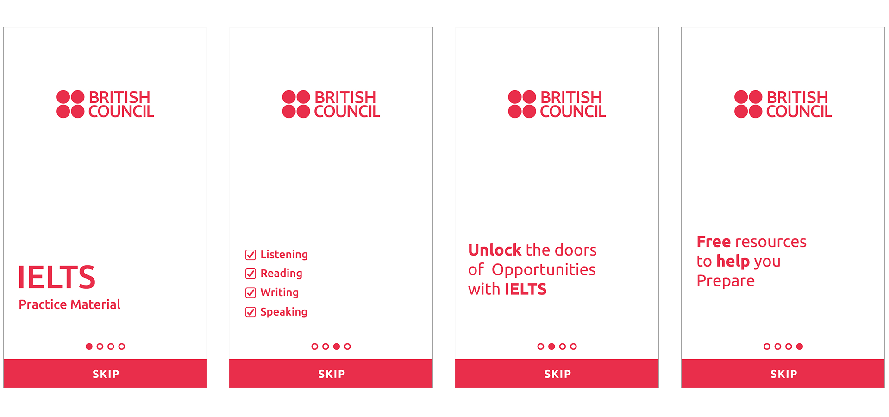
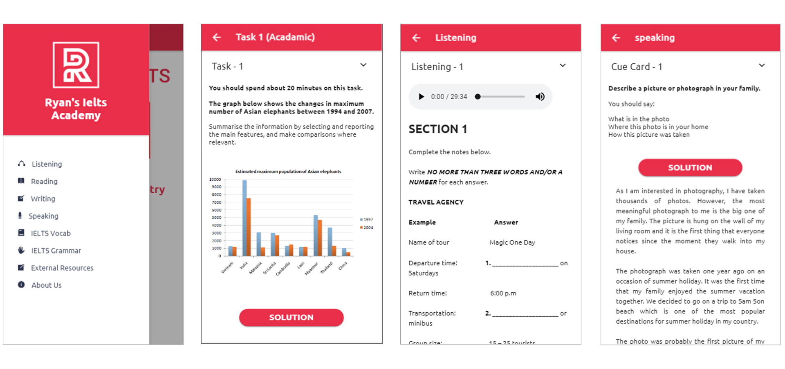

# IELTS KEYs (Mobile Application)

IELTS KEYs is an educational application aims at providing students with relevant and trending material related to IELTS exam. All four modules of IELTS are covered in the app with detailed contents.

## Getting Started

1.Homwpage
2. Listening Module
3. Reading Module
4. Writing Module
5. Speaking Module

### Prerequisites

1. Ionic3
2. HTML/CSS

### Installing

1. Download the installer for Node.js 6 or greater.
2. Install the ionic CLI globally: npm install -g ionic
3. Clone this repository: git clone https://github.com/bhinderjitsinghkaler/IELTS-KEYs
4. Run npm install from the project root.
5. Run ionic serve in a terminal from the project root

## ADD CONTENT

<ion-content no-padding scroll="false" class="bg">
    

        
    

    <ion-slides no-padding pager autoplay="2000" loop="true" speed="2000">
        <ion-slide>           
            

                
 <b style="color:#e92e4a; font-size:60px;">IELTS</b>  Practice Material

            

        </ion-slide>
        <ion-slide>
            

                
<b>Unlock</b> the doors  of Opportunities  with <b>IELTS</b>

            

        </ion-slide>
        <ion-slide>
            <table class="mylist">
                <tr>
                    <td style="padding:5px 0px 5px 0px;"> </td>
                    <td style="font-size: 23px; font-family:ubuntu; color:#e92e4a;">
                        
<b>Reading</b>

                    </td>
                </tr>
                <tr>
                    <td style="padding:5px 0px 5px 0px;"> </td>
                    <td style=" font-size: 23px; font-family:ubuntu; color:#e92e4a;">
                        
<b>Listening</b>

                    </td>
                </tr>
                 </table>
        </ion-slide>
        <ion-slide>
            

                
<b>Free</b> resources  to prepare for  IELTS <b>IELTS</b>

            

        </ion-slide>
    </ion-slides>
</ion-content>

## App UI

## Version

2.0

## Author

Bhinderjit Singh Kaler
